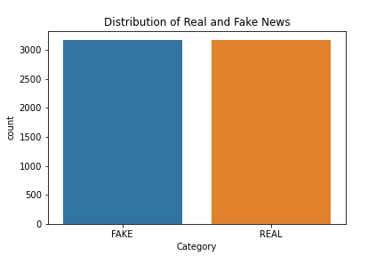

# Fake News Detection

With massive amount of information readily available on the internet nowadays, it gets harder to identify what sources we can trust and what not to. Especially when lots of them contains clickbaits and/or keywords that are simply used to gain monetary benefit or promote certain propaganda for certain parties.

In this project, I tried to explore the problem in a beginner-friendly setting to perhaps help more newly graduated data scientist understand the flow of approaching and logic behind the tools chosen for the task.

## Dependencies
- NumPy
- Pandas
- Sklearn
- Visualization: MatPlotLib, Seaborn

## Exploratory Data Analysis (EDA)
Befor we jump into the fancy coding and result analysis, it is always a good habit to visusally inspect the dataset ([source](https://drive.google.com/file/d/1er9NJTLUA3qnRuyhfzuN0XUsoIC4a-_q/view)).

- 1st column shows the word counts for each article.
- 2nd column shows the title of the article.
- 3rd column contains the article itself.
- 4th column is the label of the article, it is either FAKE or REAL.

First we look at the shape of the dataset, it has **6335 records (row)** with **4 features (column)** for each record. Whether or not you have sufficient records depends on the task and model you are planning to use but if **the shape is NOT square** (row : column ~ 1 : 1), then you should have a good start.

Another thing we should look at is the word count, there are on **average 5280 words in each article**, with 6335 articles, our total count of words shoot up to **33 million words**. 

Processing large amount of data can easily stress out our system (or "resource"). For the scope of this project, I will not deploy this model in real-life but will include some methods to tidy up the dataset and make modeling slightly easier.

Another aspect we should check with is the ratio of the labels, in this case, how many fakes news comparing to the real news.

To yield the best result in training the model, ideally we would like to have a relatively balanced labels in both categories to prevent any bias. 

For example, if we have more than 90% of the articles labelled "FAKE" and we proceed to train and test our model, it would most likely yield a high percetage in the accuracy. **BUT**, we cannot confidently say that the model was trainned properly. The model would tend to say ***"Hey, all of them are fake!"*** and simply bet on its chances to get good result.

Remember when back in highschool trying to do the multiple choice exam and we didn't know the answer, we (or at least I did) always tried to think *"I think most of the time, the answers are Cs, so if I choose C, I will have a better chance to get a correct answer."* If we train our model with highly imbalanced labels, this is exactly what the machine would think.

For this given dataset, we have really balanced labels between FAKE and REAL news so we are covered on this part.

## Data Transformation
Clearly, computer does not see words the way human sees them. Computer does not understand *meaning* behind a certain combination between the alphabets, computer sees numbers. So we would need a way to transform the letters into numbers in a meaningful way that can help us solve the problem.

But first, to keep the training and testing consistant and contained, we will need to split the whole dataset into **train group** and **test group**. This way, we can make sure that the data we used in both training and predicting fall under the same population and distribution. We will also need to apply all the transformations we are about to do on the training group to the testing group to keep them equally updated.

To transform letters into numbers without losing their relative meanings in the article, we choose *Term Frequency-Inverse Document Frequency (TF-IDF) vectorizor*. It is essentially 2 measures combined working towards the transformation. *Term Frequncy*, as the name implies, measures the times the words appeared in the article; *Inverse Document Frequency* measures how unique the words are within **ALL the articles in the scope.** Multiply the 2 measures and you get the final score from the TF-IDF transformation. It is a popular and very useful transformation on many *Natural Language Processing (NLP)*, if you are interested, here is a [short blog](https://monkeylearn.com/blog/what-is-tf-idf/#:~:text=TF%2DIDF%20(term%20frequency%2D,across%20a%20set%20of%20documents.)) that goes a bit into detail of this function.
