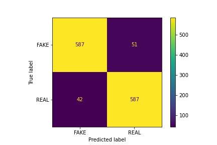

# Fake News Detection

With massive amount of information readily available on the internet nowadays, it gets harder to identify what sources we can trust and what not to. Especially when lots of them contains clickbaits and/or keywords that are simply used to gain monetary benefit or promote certain propaganda for certain parties.

Besides building model to identitfy the fake news, I will also include the reasons behind the tech stacks chosen and perhaps help out more newly data science graduates understand the flow of the analysis.
## Data Source
Befor we jump into the fancy coding and result analysis, it is always a good habit to visusally inspect the dataset ([source](https://drive.google.com/file/d/1er9NJTLUA3qnRuyhfzuN0XUsoIC4a-_q/view)).

- 1st column shows the word counts for each article.
- 2nd column shows the title of the article.
- 3rd column contains the article itself.
- 4th column contains the labelled of the article, FAKE or REAL.

First we look at the shape of the dataset, it has **6335 records** (row) with **4 features** (column) for each record. In general, 

The whole dataset contains 6335 articles with average 5280 words in each of them.